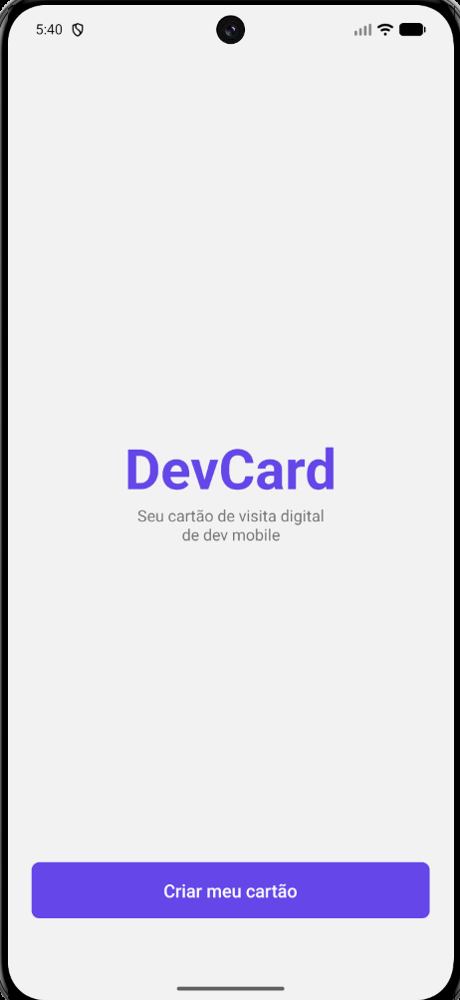
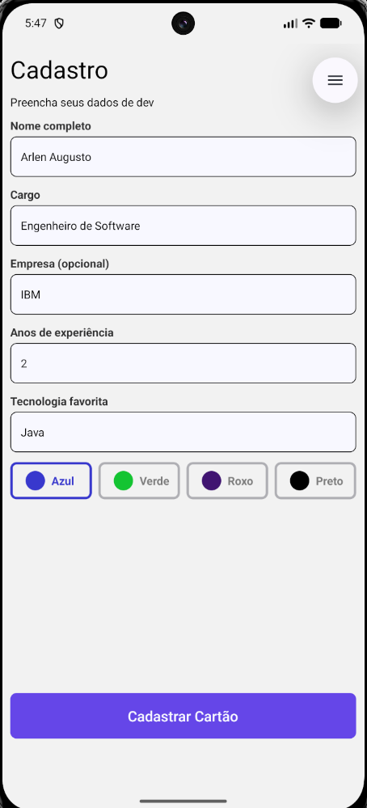
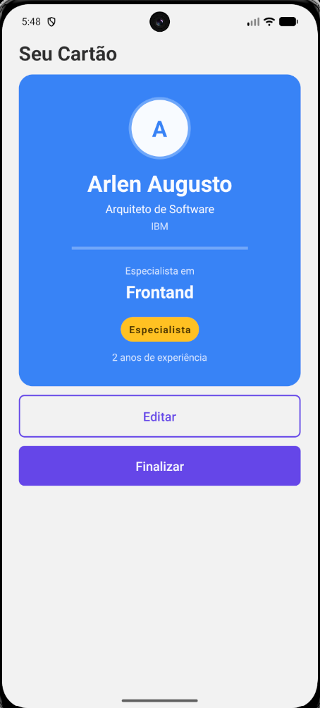
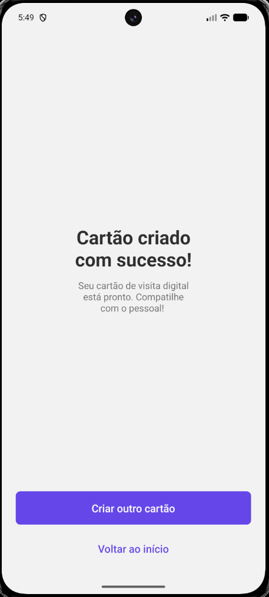

# DevCard 

O projeto proposto consiste em quatro telas (tela inicial/index, cadastro, prewiew e sucesso) cada uma com componentes diferentes. Funciona como um cartão de visita digital para desenvolvedores mobile.O usuário consegue escolher uma cor para o cartão e visualizar o resultado final.

# Objetivo do projeto

Acredito que o objetivo do projeto tenha sido praticar o desenvolvimento mobile em RN com conceitos de navegação e comunicação entre elementos e pastas.

# Funcionalidades

Tela inicial de apresentação --> Cadastro de dados o usuário insere seus dados e esolhe uma cor para o seu DevCard --> Tela com o cartão da cor escolhida dentre as ofertadas e seus dados no cartão, podendo fizalzar ou editar --> Tela de sucesso, após finalizar a criação do cartão o usuário chega nessa última tela, podendo criar outro cartão ou voltar ao início.

# Comentário 

Fala Brendon! Estou enviando fora do prazo pois de fato não consegui de maneira alguma terminar antes. Fiz confome o vídio postado no AVA e como tem que pausar para entender e codar demorei muitas horas para poder concluir, também me deparei com diversos erros que inpactaram na eficiencia de entrega. Usei IA somente para tirar dúvida em relação aos erros, de resto foi tudo na mão.

# Telas 

segue imagem das telinhas:

